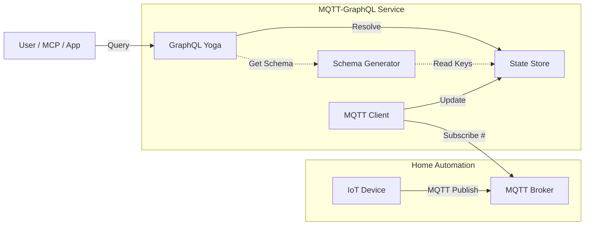

# MQTT-GraphQL

A lightweight service that subscribes to your MQTT topics and exposes them as a dynamic **GraphQL API**. Ideal for homelabs and home automation setups where you want to query your device state (e.g., from Zigbee2MQTT, Ecowitt, or Homebridge) using modern interfaces like MCP or web apps.

## Architecture

This service acts as a bridge between the message-based world of MQTT and the query-based world of GraphQL.



## Features

- **Dynamic Schema**: The API schema automatically evolves as new topics appear. No manual configuration required.
- **Type Inference**: Automatically detects number, boolean, and JSON payloads.
- **Wildcard Querying**: Use powerful filtering patterns like `home/+/temp` to query across your topic tree.
- **Docker Ready**: Runs effortlessly as a lightweight container.

## Getting Started

### 1. Run with Docker Compose

Creates the service and a local Mosquitto broker.

```bash
docker compose up -d
```

### 2. Publish Data

Push some test data to the broker:

```bash
# Using the included mosquitto container client
docker compose exec mosquitto mosquitto_pub -t "home/livingroom/temp" -m "23.5"
docker compose exec mosquitto mosquitto_pub -t "home/kitchen/light" -m "on"
docker compose exec mosquitto mosquitto_pub -t "device/sensor1" -m '{"battery": 80, "linkquality": 50}'
```

### 3. Query Data

Open your browser to [http://localhost:4000/graphql](http://localhost:4000/graphql) to use the GraphQL IDE.

#### **Direct Object Query**
Navigate the topic paths as if they were JSON objects. The schema is generated from your actual topic structure.

```graphql
query {
  home {
    livingroom {
      temp
    }
  }
}
```

#### **Wildcard / Pattern Match**
Query across multiple "rooms" or devices using MQTT-style wildcards.

```graphql
query {
  match(pattern: "home/+/temp") {
    path
    value
  }
}
#### **Deep JSON Querying**
When MQTT payloads are JSON objects, they are **flattened** so you can query sub-fields directly.
If `ecowitt/value` contains `{"temp": 22, "humidity": 60}`:

```graphql
query {
  ecowitt {
    value {
      temp
      humidity
    }
  }
}
```

If you need the **raw JSON object** (e.g., to see all fields without selecting them), use `_value`:
```graphql
query {
  ecowitt {
    value {
      _value
    }
  }
}
```

## Configuration

| Environment Variable | Default | Description |
|----------------------|---------|-------------|
| `MQTT_BROKER_URL`    | `mqtt://localhost:1883` | URL of your MQTT Broker |
| `MQTT_TOPIC_ROOT`    | `#` | Topic pattern to subscribe to (e.g., `home/#`) |
| `MQTT_USERNAME`      | - | Optional: MQTT Username |
| `MQTT_PASSWORD`      | - | Optional: MQTT Password |
| `PORT`               | `4000` | HTTP Port for GraphQL server |

## Development

```bash
# Install dependencies
npm install

# export environment variables
export MQTT_BROKER_URL=mqtt://broker.local:1883
export PORT=4000

# Run in dev mode (hot reload)
npm run dev

# Build and start production
npm run build
npm start
```

## Programmatic Access

You can query the API using standard HTTP POST requests. This is useful for integrating with other services or MCPs.

### cURL Example
```bash
curl -X POST http://localhost:4000/graphql \
  -H "Content-Type: application/json" \
  -d '{"query": "query { yalexs { <serialnumber> { currentValue } } }"}'
```
